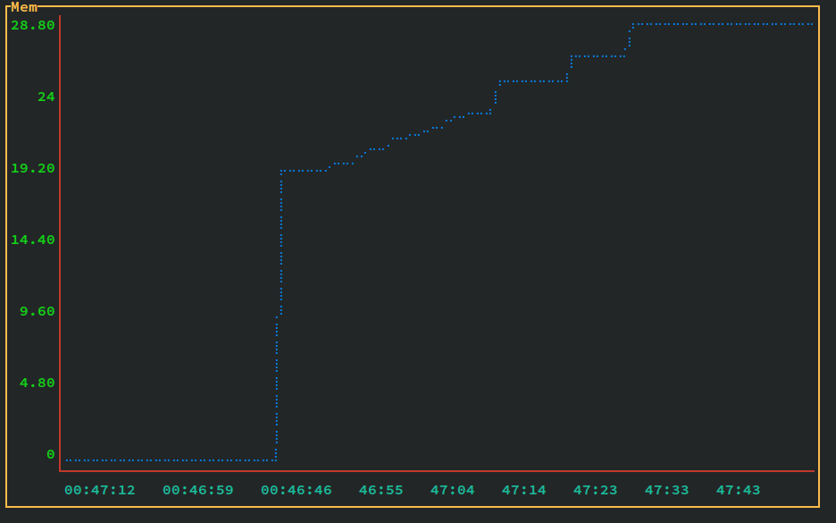

# Memonitor
Monitor memory usage of a single process;



## To run

```bash
go build
```

```bash
./memonitor <pid> <interval_millisecond>
```

## As system command

```bash
sudo cp memonitor /usr/local/bin 
```